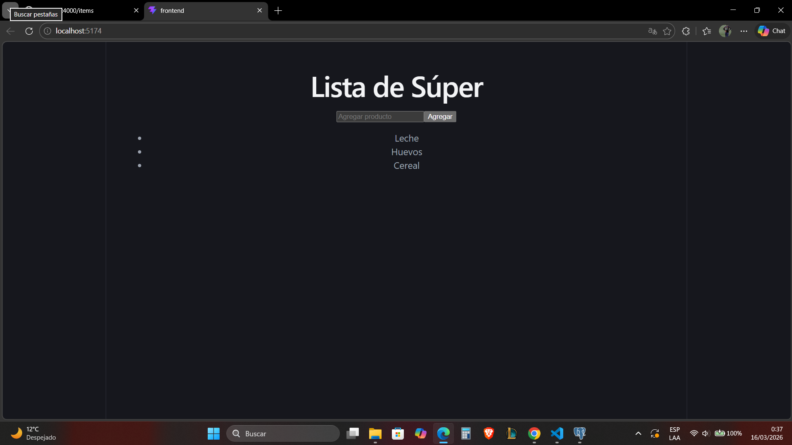
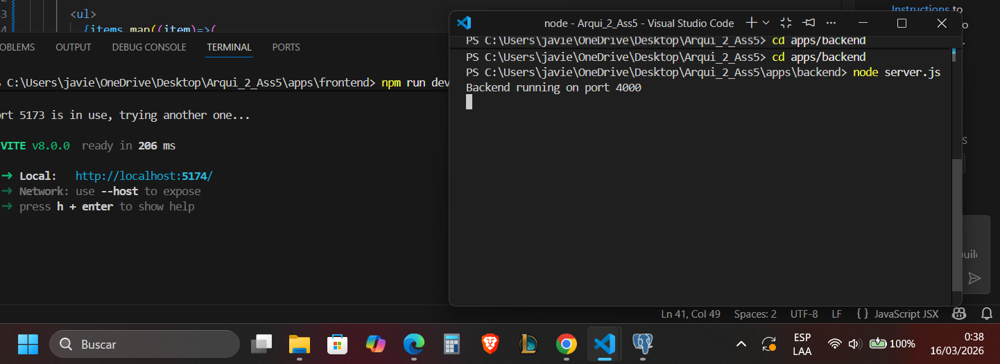
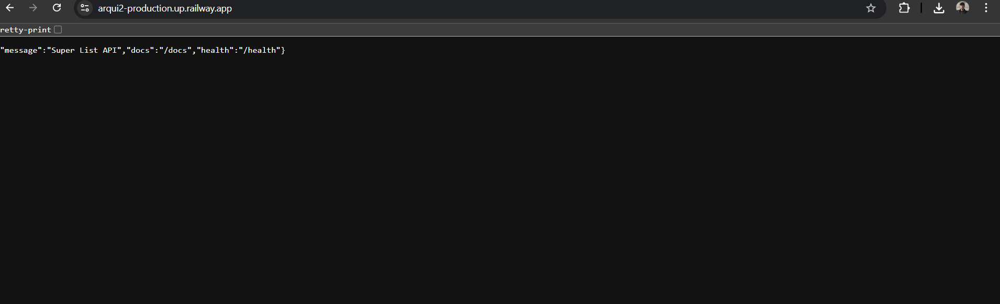
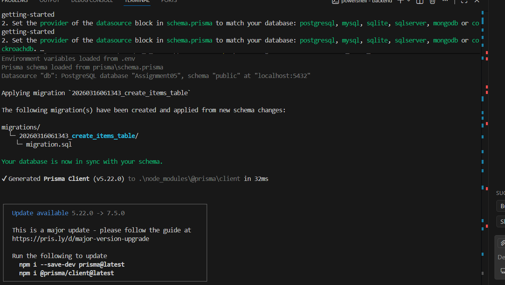
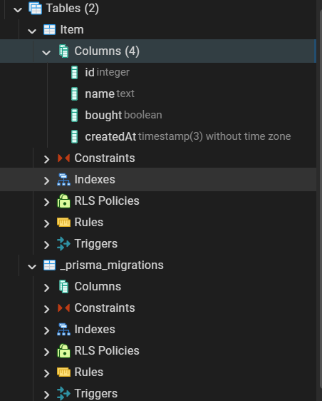
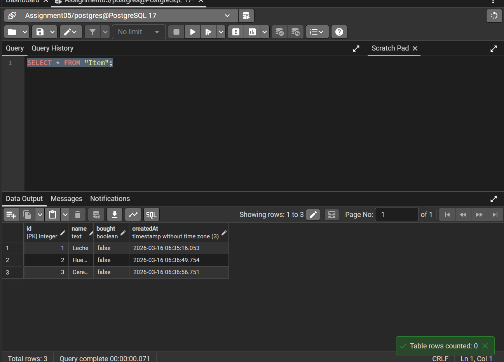
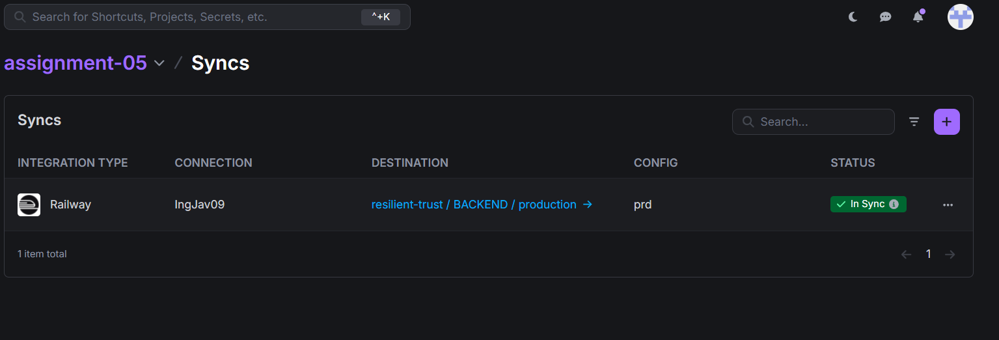

# Assignment 05 - Lista del Súper (Monorepo)

## Descripción
Aplicación web de lista del supermercado desarrollada como monorepo con frontend React + Vite, backend Node.js + Express + Prisma, y base de datos PostgreSQL. Desplegada completamente en Railway con secretos gestionados por Doppler.

## URLs
- **Frontend:** https://agile-creativity-production.up.railway.app
- **Backend:** https://arqui2-production.up.railway.app
- **Documentación API (Swagger):** https://arqui2-production.up.railway.app/docs

## Frontend


## Conexión Frontend y Backend


## Backend


## Base de Datos


## Migraciones


## SQL Funcionando


## Doppler


## Tecnologías utilizadas
- React + Vite (Frontend)
- Node.js + Express (Backend)
- Prisma ORM (Migraciones)
- PostgreSQL (Base de datos)
- Swagger (Documentación API)
- Doppler (Gestión de secretos)
- Railway (Deployment)

## Estructura del Monorepo
```
assignment-05/
├── apps/
│   ├── frontend/    ← React + Vite
│   └── backend/     ← Node.js + Express + Prisma
└── README.md
```