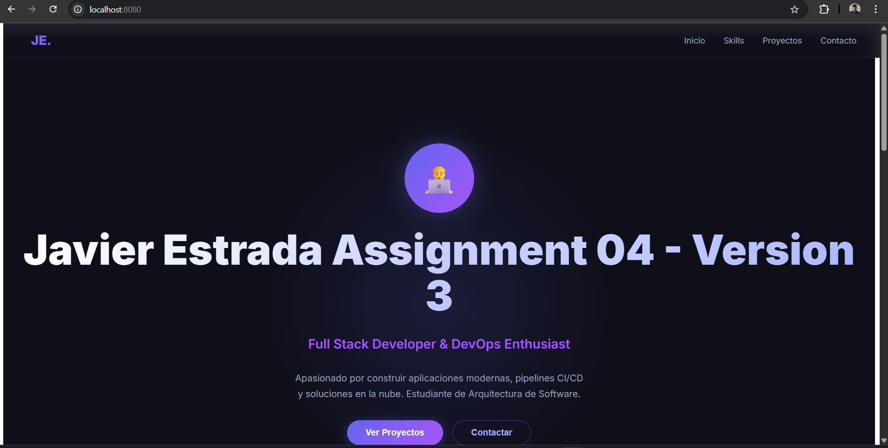
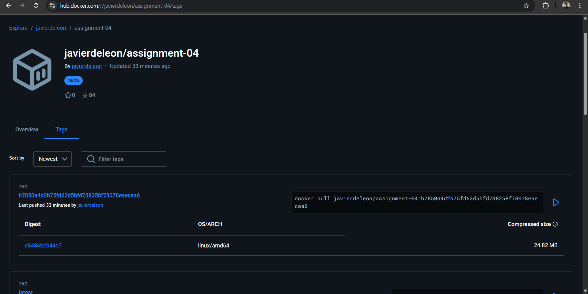
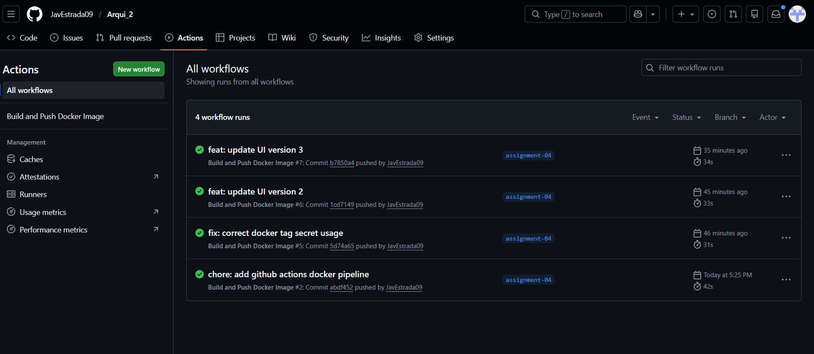
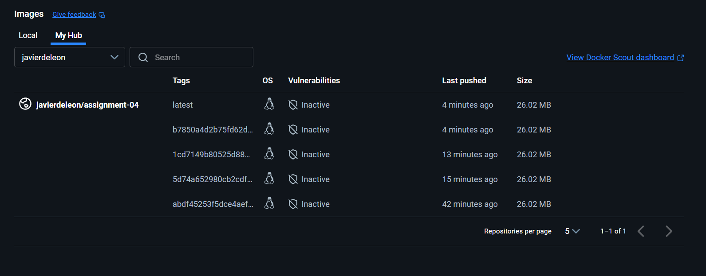

# Assignment 04 - Portfolio App Dockerizada

## Descripción
Aplicación web de portfolio personal desarrollada con React + Vite, dockerizada y desplegada automáticamente en Docker Hub mediante un pipeline de GitHub Actions.

## Aplicación


## Tecnologías utilizadas
- React + Vite
- Docker + Nginx
- GitHub Actions (CI/CD)
- Doppler (gestión de secretos)

## Docker Hub
URL de la imagen: https://hub.docker.com/r/javierdeleon/assignment-04


## Cómo correr la app localmente con Docker
```bash
docker build -t my-app .
docker pull javierdeleon/arqui2-assignment04:latest
docker run -p 8080:80 javierdeleon/arqui2-assignment04:latest
```
Abrir en el navegador: http://localhost:8080

## Pipeline de GitHub Actions
El pipeline se ejecuta automáticamente en cada commit a la rama `assignment-04` y realiza:
1. Build de la imagen Docker
2. Push a Docker Hub con dos tags:
   - `latest` (siempre apunta al último commit)
   - SHA del commit (identificador único por cada build)


## Imágenes y Tags en Docker Hub
