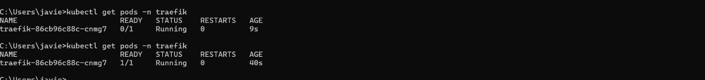
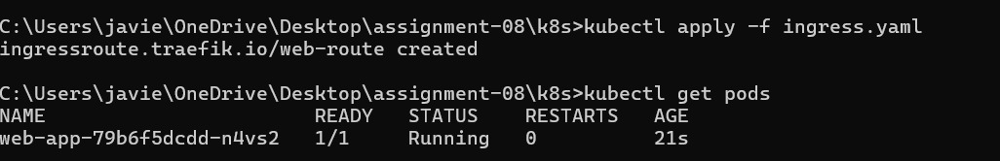
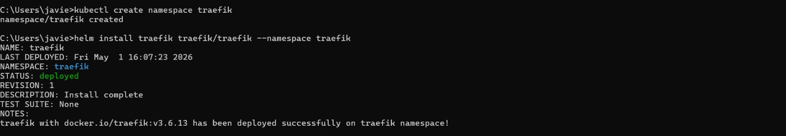
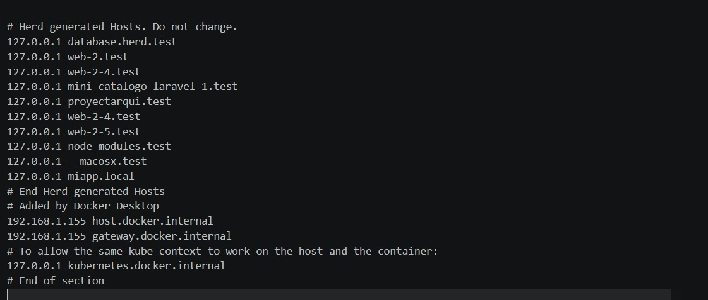
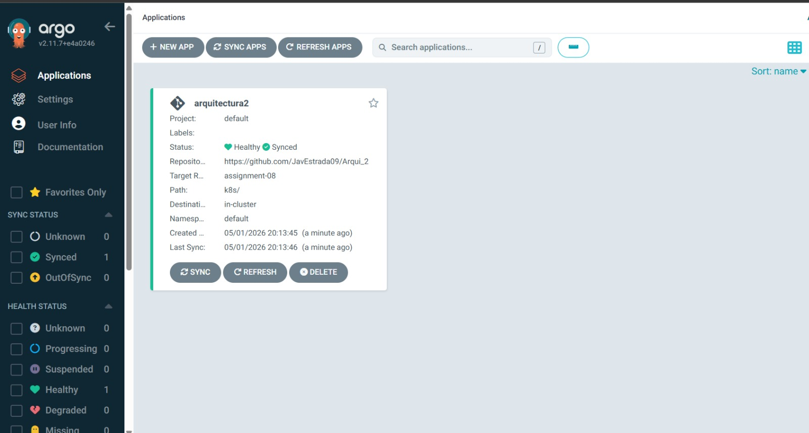
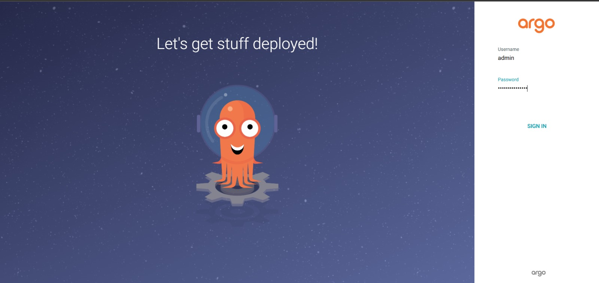
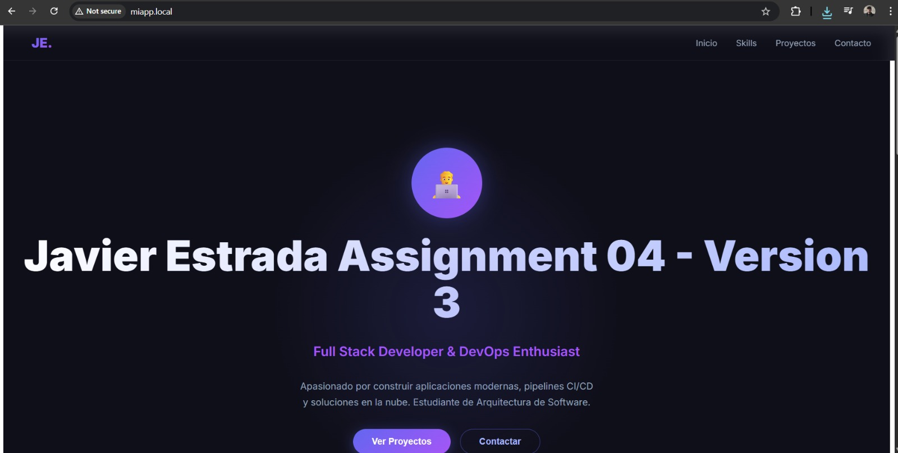

# Assignment 08 — Kubernetes (Minikube + Traefik + ArgoCD)

## 📌 Descripción

En esta actividad se construyó un clúster de Kubernetes usando Minikube y se desplegó una aplicación web previamente dockerizada (Assignment 04).
Se configuró **Traefik** como Ingress Controller, **ArgoCD** para gestión GitOps y un **DNS local** para acceder a los servicios mediante dominio personalizado.

---

## 🧰 Tecnologías utilizadas

* Kubernetes (Minikube)
* Traefik (Ingress Controller)
* ArgoCD (GitOps)
* Docker & Docker Hub
* GitHub
* Windows (hosts file para DNS local)

---

## 🏗️ Arquitectura

* Minikube ejecutando el clúster local
* Traefik manejando rutas HTTP
* ArgoCD sincronizando desde GitHub
* Aplicación desplegada vía YAML (IaC)

---

# ⚙️ Instalación del entorno

## 1. Instalación de Minikube

```bash
minikube start
```

## 2. Verificación

```bash
kubectl get nodes
```

---

## 📸 Capturas — Instalación (mínimo 7)

> Coloca aquí tus capturas (puedes usar tantas como quieras)





---

# 🚀 Instalación de Traefik

```bash
helm repo add traefik https://traefik.github.io/charts
helm repo update
kubectl create namespace traefik
helm install traefik traefik/traefik --namespace traefik
```

Verificación:

```bash
kubectl get pods -n traefik
```

---

# 🔐 Instalación de ArgoCD

```bash
kubectl create namespace argocd
kubectl apply -n argocd -f https://raw.githubusercontent.com/argoproj/argo-cd/v2.11.7/manifests/install.yaml
```

Obtener contraseña:

```powershell
[System.Text.Encoding]::UTF8.GetString([System.Convert]::FromBase64String((kubectl -n argocd get secret argocd-initial-admin-secret -o jsonpath="{.data.password}")))
```

---

# 🌐 Configuración de DNS local

Editar archivo:

```text
C:\Windows\System32\drivers\etc\hosts
```

Agregar:

```text
127.0.0.1 miapp.local
127.0.0.1 argo.javier.com
```
 


---

# 🌍 Túnel de Minikube

```bash
minikube tunnel
```

---

# 📦 Despliegue de la aplicación

Los manifiestos se encuentran en:

```text
k8s/
```

Incluyen:

* Deployment
* Service
* IngressRoute (Traefik)

---

# 🔁 Configuración de ArgoCD

Repositorio:

```text
https://github.com/JavEstrada09/Arqui_2
```

Branch:

```text
assignment-08
```

Path:

```text
k8s/
```

Namespace:

```text
default
```

---

# 📸 Capturas — ArgoCD




---

# 🌐 Acceso a la aplicación

```text
http://miapp.local
```

---

# 📸 Capturas — Aplicación desplegada




---

# 📊 Resultado

* ✔ Clúster funcional
* ✔ Traefik configurado
* ✔ ArgoCD funcionando
* ✔ GitOps implementado
* ✔ Aplicación desplegada con dominio local

---

# 📁 Estructura del proyecto

```text
k8s/
 ├── deployment.yaml
 ├── service.yaml
 ├── ingress.yaml
README.md
```

---

# 🧠 Conclusión

Se logró implementar un entorno completo de Kubernetes con enfoque DevOps, aplicando principios de infraestructura como código (IaC) y despliegue continuo mediante ArgoCD.

---

# 👤 Autor

Javier Estrada
